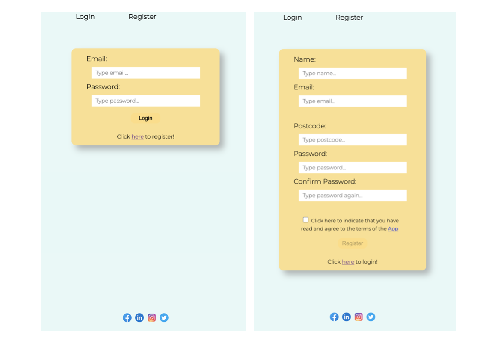
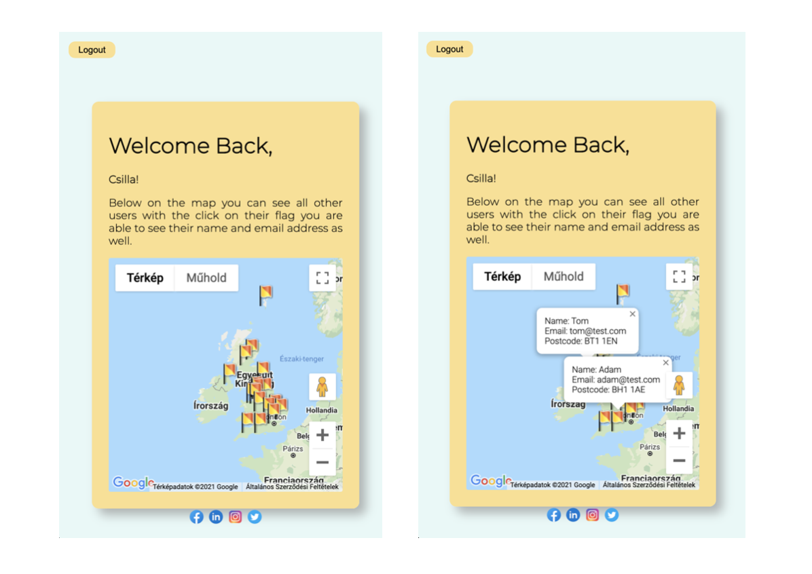

## Project using the Google map API

The project has 3 pages Login, Register and Home.
On the Register page the user is being asked for registering and required to provide their postcode.
Once registered the user is being redirected to the Home page where he can see a map and all other users who are registered with a flag on a map.
If they click on the flag they are able to see the other registered user's details such as email address, name, postcode.

### Desigen

Register and Login Page:


Home Page:


### Built with:

-   [Laravel](https://laravel.com/)
-   [JavaScript](https://www.javascript.com/)
-   [CSS](https://developer.mozilla.org/en-US/docs/Web/CSS)
-   [Axios](https://www.npmjs.com/package/axios)
-   [Google Geocoding API for Laravel](https://github.com/jotafurtado/geocode)

### How to run the app

-   First step clone the repository

```
git clone //repolink//
```

-   cd into the project
-   Install composer dependencies

```
composer install
```

-   Install NPM dependencies

```
npm install
```

-   Create a copy of your .env file

```
cp .env.example .env
```

-   Generate an app encryption key

Laravel requires you to have an app encryption key which is generally randomly generated and stored in your <mark>.env</mark> file. The app will use this encryption key to encode various elements of your application from cookies to password hashes and more.

Laravel’s command line tools thankfully make it super easy to generate this. In the terminal we can run this command to generate that key. (Make sure that you have already installed Laravel via composer and created an .env file before doing this, of which we have done both).

```
php artisan key:generate
```

If you check the <mark>.env</mark> file again, you will see that it now has a long random string of characters in the <mark>APP_KEY</mark> field. We now have a valid app encryption key.

-   Create an empty database for the application

(I have used [XAMPP](https://www.apachefriends.org/hu/index.html)-[MySQL](https://www.mysql.com/))

-   In the .env file, add DB information to allow Laravel to connect to DB
-   In the .env file you also has to set your Google API Key which you can get from [here](https://developers.google.com/maps)!

You can find multiple API's you need to enable the [Maps Javascript API](https://developers.google.com/maps/documentation/javascript/overview)

-   Migrate the database

The project contains the migration files

```
php artisan migrate
```

-   And as the final step

```
php artisan serve
```

Now in your browser go to the localhost port your app started on and you can use the app
